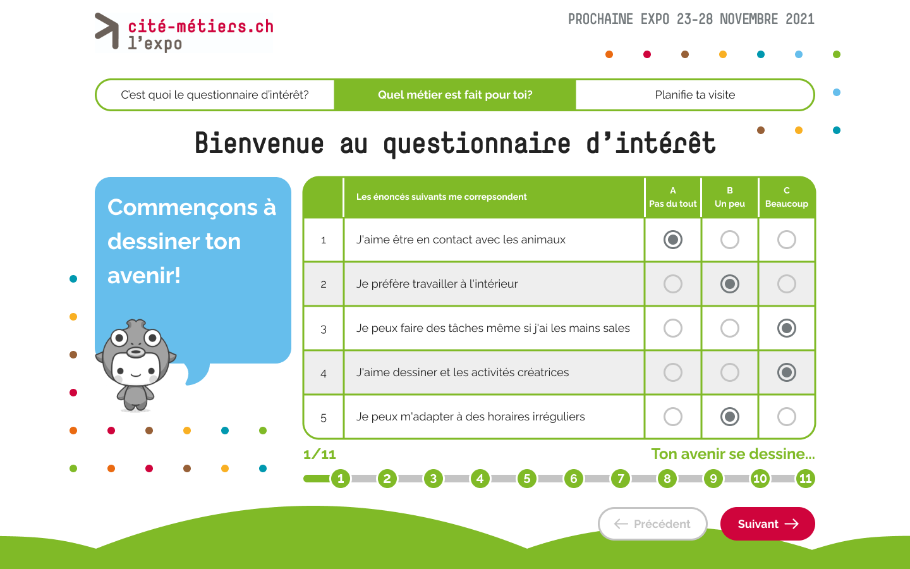

## Тестовое задание для Simpleo

### Суть задания

Нужно сделать верстку данного макета в React.
В таблице должна быть возможность выбрать один вариант в каждой строчке, так же в дизайне есть варианты активных кнопок и визуализация наведения курсора.

И реализовать свой вариант адаптива этого дизайна.



### Использованные инструменты

Проект был создан с использованием [Create React App](https://github.com/facebook/create-react-app).

### Команды

```bash
# Установка зависимостей
$ yarn install

# Запуск на http://localhost:3000/
$ yarn start

# Сборка
$ yarn build
```
